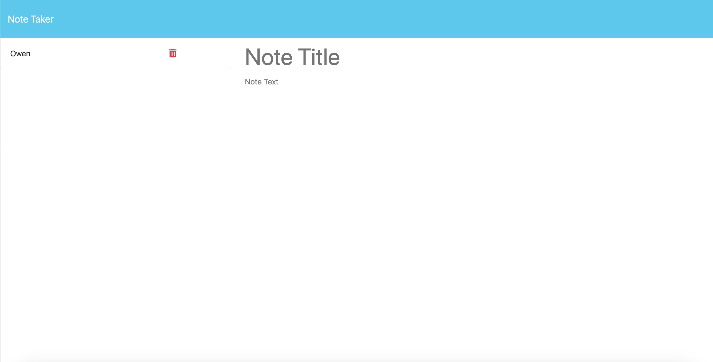

# challenge09-owen-kanzler

## Description

This is challenge #9 of the UMN Bootcamp. Here I created custom routes using express.js for a note taker app. The app allows the user to create, save, and delete notes. The notes are saved to a json file and are displayed on the left side of the screen. The user can click on a note to view it on the right side of the screen. The user can also click the trash can icon to delete the note.

## Assets

## Usage

https://owenkanzler.github.io/challenge09-owen-kanzler/

## License

Please refer to the LICENSE in the repo.
